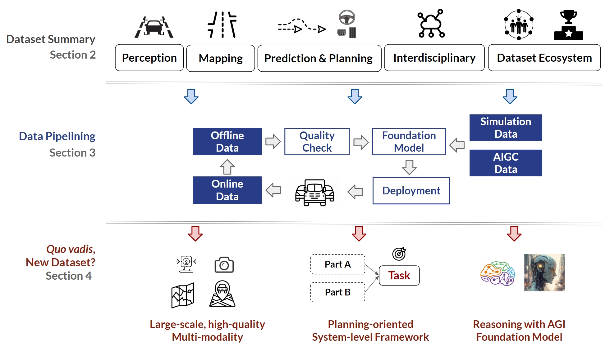
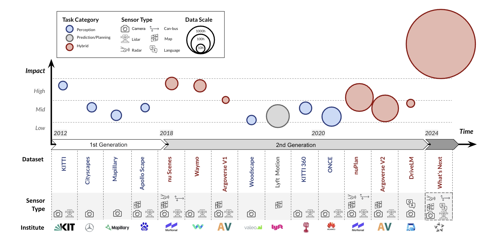
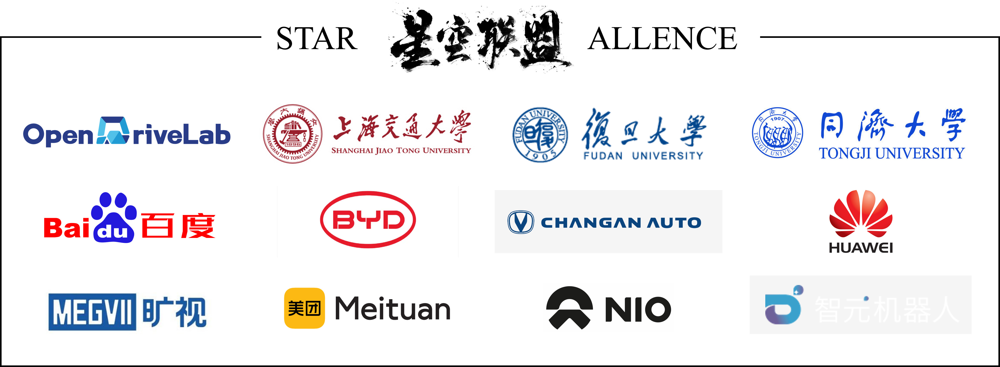

# DriveAGI
This is **"The One"** project that [**`OpenDriveLab`**](https://opendrivelab.com/) is committed to contribute to the community, providing some thought and general picture of how to embrace `foundation models` into autonomous driving.

## NEWS
**`2024/01/24`**
<!-- > - We present [ad-dataset website](https://orangegk.github.io/AutonomousDrivingDataset/#/) that provides such an overview for more than 150 datasets and thank Daniel Bogdoll for his contribution on that.> -->
- We are excited to announce some update to this work and would like to thank John Lambert, Klemens Esterle from the public community for their advice to improve the manuscript.
## At A Glance

Here are some key components to construct a large foundation model curated for an autonomous system.


## DriveData

### Abstract
With the continuous maturation and application of autonomous driving technology, a systematic examination of open-source autonomous driving datasets becomes instrumental in fostering the robust evolution of the industry ecosystem. In this survey, we provide a comprehensive analysis of more than 70 papers on the timeline, impact, challenges, and future trends in autonomous driving dataset.

<!-- > [Hongyang Li](https://lihongyang.info/)<sup>1</sup>, Yang Li<sup>1</sup>, [Huijie Wang](https://faikit.github.io/)<sup>1</sup>, [Jia Zeng](https://scholar.google.com/citations?user=kYrUfMoAAAAJ)<sup>1</sup>, Pinlong Cai<sup>1</sup>, Dahua Lin<sup>1</sup>, Junchi Yan<sup>2</sup>, Feng Xu<sup>3</sup>, Lu Xiong<sup>4</sup>, Jingdong Wang<sup>5</sup>, Futang Zhu<sup>6</sup>, Kai Yan<sup>7</sup>, Chunjing Xu<sup>8</sup>, Tiancai Wang<sup>9</sup>, Beipeng Mu<sup>10</sup>, Shaoqing Ren<sup>11</sup>, Zhihui Peng<sup>12</sup>, Yu Qiao<sup>1</sup>
> 
> <sup>1</sup> Shanghai AI Lab, <sup>2</sup> Shanghai Jiao Tong University, <sup>3</sup> Fudan University, <sup>4</sup> Tongji University, <sup>5</sup> Baidu, <sup>6</sup> BYD, <sup>7</sup> Changan, <sup>8</sup> Huawei, <sup>9</sup> Megvii Technology, <sup>10</sup> Meituan, <sup>11</sup> Nio Automotive, <sup>12</sup> Agibot
> -->


>Current autonomous driving datasets can broadly be categorized into two generations since the 2010s. We define the Impact (y-axis) of a dataset based on sensor configuration, input modality, task category, data scale, ecosystem, etc.



### Related Work Collection 

We present comprehensive paper collections, leaderboards, and challenges.(Click to expand)

<details>
<summary>Challenges and Leaderboards</summary>

<table>
<capital></capital>
<tr align="middle"> </tr>
<tr align="middle">
    <th >Title</th>
    <th >Host</th>
    <th >Year</th>
    <th >Task</th>
    <th >Entry</th>
</tr>

<tr align="middle">
      <td rowspan=7 ><a href="https://opendrivelab.com/AD23Challenge.html" target="_blank" title="Autonomous Driving Challenge">Autonomous Driving Challenge</a></td>
  	  <td rowspan=7 > OpenDriveLab</td>
      <td rowspan=7 >CVPR2023</td>
       <td>Perception / OpenLane Topology</td>
    	<td rowspan=7> 111 </td>
</tr>
<tr align="middle"> </tr>
<tr align="middle">
       <td>Perception / Online HD Map Construction</td>
</tr>
<tr align="middle"> </tr>
<tr align="middle">
       <td>Perception / 3D Occupancy Prediction</td>
</tr>
<tr align="middle"> </tr>
<tr align="middle">
        <td>Prediction & Planning / nuPlan Planning</td>
</tr>

<tr align="middle">
      <td rowspan=23 ><a href="https://waymo.com/open/challenges/" target="_blank" title="Waymo Open Dataset
Challenges">Waymo Open Dataset Challenges</a></td>
  	  <td rowspan=23 > Waymo</td>
      <td rowspan=8>CVPR2023</td>
       <td>Perception / 2D Video Panoptic Segmentation</td>
    	<td rowspan=8> 35 </td>
</tr>
<tr align="middle"> </tr>
<tr align="middle">
       <td>Perception / Pose Estimation</td>
</tr>
<tr align="middle"> </tr>
<tr align="middle">
       <td>Prediction / Motion Prediction</td>
</tr>
<tr align="middle"> </tr>
<tr align="middle">
    <td>Prediction / Sim Agents</td>
</tr>
<tr align="middle"> </tr>
<tr align="middle"> 
      <td rowspan=8>CVPR2022</td>
       <td>Prediction / Motion Prediction</td>
    	<td rowspan=8> 128 </td>
</tr>
<tr align="middle"> </tr>
<tr align="middle">
       <td>Prediction / Occupancy and Flow Prediction</td>
</tr>
<tr align="middle"> </tr>
<tr align="middle">
       <td>Perception / 3D Semantic Segmentation</td>
</tr>
<tr align="middle"> </tr>
<tr align="middle">
       <td>Perception / 3D Camera-only Detection</td>
</tr>
<tr align="middle"> </tr>
<tr align="middle"> 
 <td rowspan=7>CVPR2021</td>
       <td>Prediction / Motion Prediction</td>
    	<td rowspan=7> 115 </td>
  </tr>
<tr align="middle"> </tr>
<tr align="middle">
       <td>Prediction / Interaction Prediction</td>
</tr>
<tr align="middle"> </tr>
<tr align="middle">
       <td>Perception / Real-time 3D Detection</td>
</tr>
<tr align="middle"> </tr>
<tr align="middle">
       <td>Perception / Real-time 2D Detection</td>
</tr>
<tr align="middle">
      <td rowspan=19 ><a href="https://www.argoverse.org/tasks.html" target="_blank" title="Argoverse
Challenges">Argoverse Challenges</a></td>
  	  <td rowspan=19 > Argoverse</td>
      <td rowspan=8>CVPR2023</td>
       <td>Prediction / Multi-agent Forecasting</td>
    	<td rowspan=8> 81 </td>
</tr>
<tr align="middle"> </tr>
<tr align="middle">
       <td>Perception & Prediction / Unified Sensorbased Detection, Tracking, and Forecasting</td>
</tr>
<tr align="middle"> </tr>
<tr align="middle">
       <td>Perception / LiDAR Scene Flow</td>
</tr>
<tr align="middle"> </tr>
<tr align="middle">
       <td>Prediction / 3D Occupancy Forecasting</td>
</tr>
<tr align="middle"> </tr>
<tr align="middle">
  <td rowspan=6>CVPR2022</td>
       <td>Perception / 3D Object Detection</td>
    	<td rowspan=6> 81 </td> 
</tr>
<tr align="middle"> </tr>
<tr align="middle">
       <td>Prediction / Motion Forecasting</td>
</tr>
<tr align="middle"> </tr>
<tr align="middle">
       <td>Perception / Stereo Depth Estimation</td>
</tr>
<tr align="middle"> </tr>
<tr align="middle"> 
      <td rowspan=5>CVPR2021</td>
       <td>Perception / Stereo Depth Estimation</td>
    	<td rowspan=5> 368 </td>
</tr>
<tr align="middle"> </tr>
<tr align="middle">
       <td>Prediction / Motion Forecasting</td>
</tr>
<tr align="middle"> </tr>
<tr align="middle">
       <td>Perception / Streaming 2D Detection</td>
</tr>

<tr align="middle">
      <td rowspan=5 ><a href="https://carlachallenge.org/" target="_blank" title="CARLA Autonomous Driving Challenge">CARLA Autonomous Driving Challenge</a></td>
  	  <td rowspan=5 > CARLA Team, Intel</td>
      <td rowspan=2 >2023</td>
      <td>Planning / CARLA AD Challenge 2.0</td>
    	<td rowspan=2> - </td>
</tr>
<tr align="middle"> </tr>
<tr align="middle">
       <td rowspan=2 >NeurIPS2022</td>
       <td>Planning / CARLA AD Challenge 1.0</td>
       <td rowspan=2> 19 </td>
</tr>
<tr align="middle"> </tr>
<tr align="middle">
       <td rowspan=1 >NeurIPS2021</td>
       <td>Planning / CARLA AD Challenge 1.0</td>
       <td rowspan=1> - </td>
</tr>

<tr align="middle">
      <td rowspan=7 ><a href="https://iacc.pazhoulab-huangpu.com/" target="_blank" title="粤港澳大湾区
      （黄埔）国际算法算例大赛">粤港澳大湾区
（黄埔）国际算法算例大赛</a></td>
  	  <td rowspan=7> 琶洲实验室</td>
      <td rowspan=4>2023</td>
       <td>感知 / 跨场景单目深度估计</td>
    	<td> - </td>
</tr>
<tr align="middle"> </tr>
<tr align="middle">
       <td>感知 / 路侧毫米波雷达标定和目标跟踪</td>
       <td> - </td>
</tr>
<tr align="middle"> </tr>
<tr align="middle">
      <td rowspan=3>2022</td>
       <td>感知 / 路侧三维感知算法</td>
       <td> - </td>
</tr>
<tr align="middle"> </tr>
<tr align="middle">
       <td>感知 / 街景图像店面招牌文字识别</td>
       <td> - </td>
</tr>

<tr align="middle">
      <td rowspan=9 ><a href="https://driving-olympics.ai/" target="_blank" title="AI Driving Olympics">AI Driving Olympics</a></td>
  	  <td rowspan=9 > ETH Zurich, University of Montreal,Motional</td>
      <td> NeurIP2021 </td>
      <td rowspan=1>Perception / nuScenes Panoptic</td>
    	<td> 11 </td>
</tr>
<tr align="middle"> </tr>
<tr align="middle">
      <td rowspan=7>ICRA2021</td>
       <td>Perception / nuScenes Detection</td>
       <td rowspan=7> 456 </td>
</tr>
<tr align="middle"> </tr>
<tr align="middle">
       <td>Perception / nuScenes Tracking</td>
</tr>
<tr align="middle"> </tr>
<tr align="middle">
       <td>Prediction / nuScenes Prediction</td>
</tr>
<tr align="middle"> </tr>
<tr align="middle">
       <td>Perception / nuScenes LiDAR Segmentation</td>
</tr>

<tr align="middle">
      <td rowspan=1 ><a href="https://cg.cs.tsinghua.edu.cn/jittor/news/2021-1-22-13-14-comp/" target="_blank" title="计图 (Jittor)人工智能算法挑战赛">计图 (Jittor)人工智能算法挑战赛</a></td>
  	  <td rowspan=1 > 国家自然科学基金委信息科学部</td>
      <td> 2021 </td>
      <td rowspan=1>感知 / 交通标志检测</td>
    	<td> 37 </td>
</tr>

<tr align="middle">
      <td rowspan=1 ><a href="https://www.cvlibs.net/datasets/kitti/" target="_blank" title="KITTI Vision Benchmark Suite">KITTI Vision Benchmark Suite</a></td>
  	  <td rowspan=1 > University of Tübingen </td>
      <td> 2012 </td>
      <td rowspan=1>Perception / Stereo, Flow, Scene Flow, Depth,
Odometry, Object, Tracking, Road, Semantics</td>
    	<td> 5,610 </td>
</tr>

</table>
<p align="right">(<a href="#top">back to top</a>)</p>

</details>

<details>
<summary>Perception Datasets</summary>

<table>
<capital></capital>
<tr align="middle"> </tr>
<tr align="middle">
    <th rowspan=3 colspan=1>Dataset</th>
    <th rowspan=3 >Year</td>
    <th  align="middle" colspan=3 >Diversity</th>
    <th  align="middle" colspan=3 >Sensor</th>
    <th rowspan=3 colspan=1>Annotation</th>
    <th rowspan=3 colspan=1>Paper</th>
</tr> 
<tr align="middle"> </tr>
<tr align="middle">
  	  <th> Scenes</th>
    	<th> Hours </th>
    	<th> Region </th>
  	  <th> Camera</th>
    	<th> Lidar </th>
    	<th> Other </th>
</tr>

<tr align="middle">
      <td><a href="https://www.cvlibs.net/datasets/kitti/" target="_blank" title="Homepage">KITTI</a></td>  	  
      <td> 2012</td>
    	<td> 50 </td>
    	<td> 6 </td>
  	  <td> EU</td>
    	<td> Font-view </td>
      <td> ✗</td>
    	<td> GPS & IMU </td>
      <td>2D BBox & 3D BBox</td>
      <td><a href="https://www.cvlibs.net/publications/Geiger2012CVPR.pdf" target="_blank" title="Homepage">Link</a></td>
</tr>

<tr align="middle">
      <td><a href="https://www.cityscapes-dataset.com/" target="_blank" title="Homepage">Cityscapes</a></td>  	  <td> 2016</td>
    	<td> - </td>
    	<td> - </td>
  	  <td> EU</td>
    	<td> Font-view </td>
      <td> ✗ </td>
    	<td> </td>
      <td>2D Seg</td>
      <td><a href="https://arxiv.org/abs/1604.01685" target="_blank" title="Homepage">Link</a></td>
</tr>

<tr align="middle">
      <td><a href="http://ww1.6d-vision.com/lostandfounddataset" target="_blank" 
      title="Homepage">Lost and Found</a></td>  	  <td> 2016</td>
    	<td> 112 </td>
    	<td> - </td>
  	  <td> -</td>
    	<td> Font-view </td>
      <td> ✗ </td>
    	<td> </td>
      <td>2D Seg</td>
      <td><a href="https://arxiv.org/abs/1609.04653" target="_blank" title="Homepage">Link</a></td>
</tr>

<tr align="middle">
      <td><a href="https://eval-vistas.mapillary.com/" target="_blank" 
      title="Homepage">Mapillary</a></td>  	  
      <td> 2016</td>
    	<td> - </td>
    	<td> - </td>
  	  <td> Global</td>
    	<td> Street-view </td>
      <td> ✗ </td>
    	<td> </td>
      <td>2D Seg</td>
      <td><a href="https://openaccess.thecvf.com/content_ICCV_2017/papers/Neuhold_The_Mapillary_Vistas_ICCV_2017_paper.pdf" target="_blank" title="Homepage">Link</a></td>
</tr>

<tr align="middle">
      <td><a href="http://sensors.ini.uzh.ch/news_page/DDD17.html" target="_blank" 
      title="Homepage">DDD17</a></td>  	  
      <td> 2017</td>
    	<td> 36</td>
    	<td> 12 </td>
  	  <td> EU</td>
    	<td> Front-view </td>
      <td> ✗ </td>
    	<td> GPS & CAN-bus & Event Camera</td>
      <td>-</td>
      <td><a href="https://arxiv.org/pdf/1711.01458.pdf" target="_blank" title="Homepage">Link</a></td>
</tr>

<tr align="middle">
      <td><a href="https://github.com/ApolloScapeAuto/dataset-api" target="_blank" 
      title="Homepage">Apolloscape</a></td>  	  
      <td> 2016</td>
    	<td> 103</td>
    	<td> 2.5 </td>
  	  <td> AS</td>
    	<td> Front-view </td>
      <td> ✗ </td>
    	<td> GPS & IMU </td>
      <td> 3D BBox & 2D Seg</td>
      <td><a href="https://arxiv.org/pdf/1803.06184.pdf" target="_blank" title="Homepage">Link</a></td>
</tr>

<tr align="middle">
      <td><a href="https://github.com/JinkyuKimUCB/BDD-X-dataset" target="_blank" 
      title="Homepage">BDD-X</a></td>  	  
      <td> 2018</td>
    	<td> 6984</td>
    	<td> 77 </td>
  	  <td> NA</td>
    	<td> Front-view </td>
      <td> ✗ </td>
    	<td> </td>
      <td>Language</td>
      <td><a href="https://arxiv.org/pdf/1807.11546.pdf" target="_blank" title="Homepage">Link</a></td>
</tr>

<tr align="middle">
      <td><a href="https://usa.honda-ri.com/hdd" target="_blank" 
      title="Homepage">HDD</a></td>  	  
      <td> 2018</td>
    	<td> -</td>
    	<td> 104 </td>
  	  <td> NA</td>
    	<td> Front-view </td>
      <td> ✓  </td>
    	<td> GPS & IMU & CAN-bus </td>
      <td>2D BBox </td>
      <td><a href="https://arxiv.org/pdf/1811.02307v1.pdf" target="_blank" title="Homepage">Link</a></td>
</tr>

<tr align="middle">
      <td><a href="https://idd.insaan.iiit.ac.in/dataset/details/" target="_blank" 
      title="Homepage">IDD</a></td>  	  
      <td> 2018</td>
    	<td> 182</td>
    	<td> - </td>
  	  <td> AS</td>
    	<td> Front-view </td>
      <td> ✗  </td>
    	<td>  </td>
      <td>2D Seg </td>
      <td><a href="https://arxiv.org/pdf/1811.10200v1.pdf" target="_blank" title="Homepage">Link</a></td>
</tr>

<tr align="middle">
      <td><a href="http://semantic-kitti.org/" target="_blank" 
      title="Homepage">SemanticKITTI</a></td>  	  
      <td> 2019</td>
    	<td> 50</td>
    	<td> 6 </td>
  	  <td> EU </td>
    	<td> ✗ </td>
      <td> ✓  </td>
    	<td>   </td>
      <td>3D Seg </td>
      <td><a href="https://arxiv.org/pdf/1904.01416.pdf" target="_blank" title="Homepage">Link</a></td>
</tr>

<tr align="middle">
      <td><a href="https://github.com/valeoai/WoodScape" target="_blank" 
      title="Homepage">Woodscape</a></td>  	  
      <td> 2019 </td>
    	<td> -</td>
    	<td> - </td>
  	  <td> Global</td>
    	<td> 360° </td>
      <td> ✓  </td>
    	<td> GPS & IMU & CAN-bus </td>
      <td>3D BBox & 2D Seg </td>
      <td><a href="https://arxiv.org/pdf/1905.01489.pdf" target="_blank" title="Homepage">Link</a></td>
</tr>

<tr align="middle">
      <td><a href="https://drivingstereo-dataset.github.io/" target="_blank" 
      title="Homepage">DrivingStereo</a></td>  	  
      <td> 2019 </td>
    	<td> 42</td>
    	<td> - </td>
  	  <td> AS </td>
    	<td> Front-view </td>
      <td> ✓  </td>
    	<td>   </td>
      <td>-</td>
      <td><a href="https://ieeexplore.ieee.org/document/8954165/" target="_blank" title="Homepage">Link</a></td>
</tr>

<tr align="middle">
      <td><a href="https://github.com/Robotics-BUT/Brno-Urban-Dataset" target="_blank" 
      title="Homepage">Brno-Urban</a></td>  	  
      <td> 2019 </td>
    	<td> 67</td>
    	<td> 10 </td>
  	  <td> EU</td>
    	<td> Front-view </td>
      <td> ✓  </td>
    	<td> GPS & IMU & Infrared Camera </td>
      <td> -</td>
      <td><a href="https://arxiv.org/abs/1909.06897.pdf" target="_blank" title="Homepage">Link</a></td>
</tr>

<tr align="middle">
      <td><a href="https://github.com/I2RDL2/ASTAR-3D" target="_blank" 
      title="Homepage">A*3D</a></td>  	  
      <td> 2019 </td>
    	<td> -</td>
    	<td> 55 </td>
  	  <td> AS</td>
    	<td> Front-view </td>
      <td> ✓  </td>
    	<td>   </td>
      <td> 3D BBox </td>
      <td><a href="https://arxiv.org/pdf/1909.07541v1.pdf" target="_blank" title="Homepage">Link</a></td>
</tr>

<tr align="middle">
      <td><a href="https://github.com/talk2car/Talk2Car" target="_blank" 
      title="Homepage">Talk2Car</a></td>  	  
      <td> 2019 </td>
    	<td> 850</td>
    	<td> 283.3 </td>
  	  <td> NA</td>
    	<td> Front-view </td>
      <td> ✓  </td>
    	<td>  </td>
      <td>Language & 3D BBox </td>
      <td><a href="https://arxiv.org/pdf/1909.10838.pdf" target="_blank" title="Homepage">Link</a></td>
</tr>

<tr align="middle">
      <td><a href="https://data.vision.ee.ethz.ch/arunv/personal/talk2nav.html" target="_blank" 
      title="Homepage">Talk2Nav</a></td>  	  
      <td> 2019 </td>
    	<td> 10714</td>
    	<td> - </td>
  	  <td> Sim</td>
    	<td> 360° </td>
      <td> ✗  </td>
    	<td>  </td>
      <td>Language </td>
      <td><a href="https://arxiv.org/abs/1910.02029.pdf" target="_blank" title="Homepage">Link</a></td>
</tr>

<tr align="middle">
      <td><a href="https://github.com/aras62/PIEPredict" target="_blank" 
      title="Homepage">PIE</a></td>  	  
      <td> 2019 </td>
    	<td> -</td>
    	<td> 6 </td>
  	  <td> NA</td>
    	<td> Front-view </td>
      <td> ✗  </td>
    	<td>  </td>
      <td>2D BBox </td>
      <td><a href="https://openaccess.thecvf.com/content_ICCV_2019/papers/Rasouli_PIE_A_Large-Scale_Dataset_and_Models_for_Pedestrian_Intention_Estimation_ICCV_2019_paper.pdf" target="_blank" title="Homepage">Link</a></td>
</tr>

<tr align="middle">
      <td><a href="https://github.com/weisongwen/UrbanLoco" target="_blank" 
      title="Homepage">UrbanLoco</a></td>  	  
      <td> 2019 </td>
    	<td> 13</td>
    	<td> -</td>
  	  <td>AS & NA</td>
    	<td> 360° </td>
      <td> ✓  </td>
    	<td> IMU </td>
      <td>- </td>
      <td><a href="https://arxiv.org/abs/1912.09513.pdf" target="_blank" title="Homepage">Link</a></td>
</tr>

<tr align="middle">
      <td><a href="https://usa.honda-ri.com/titan" target="_blank" 
      title="Homepage">TITAN</a></td>  	  
      <td> 2019 </td>
    	<td> 700</td>
    	<td> - </td>
  	  <td> AS</td>
    	<td> Front-view </td>
      <td> ✗   </td>
    	<td>  </td>
      <td>2D BBox </td>
      <td><a href="https://arxiv.org/pdf/2003.13886.pdf" target="_blank" title="Homepage">Link</a></td>
</tr>

<tr align="middle">
      <td><a href="https://usa.honda-ri.com/H3D" target="_blank" 
      title="Homepage">H3D </a></td>  	  
      <td> 2019 </td>
    	<td> 160 </td>
    	<td> 0.77 </td>
  	  <td> NA</td>
    	<td> Front-view </td>
      <td> ✓  </td>
    	<td> GPS & IMU </td>
      <td>- </td>
      <td><a href="https://arxiv.org/abs/1903.01568.pdf" target="_blank" title="Homepage">Link</a></td>
</tr>

<tr align="middle">
      <td><a href="https://www.a2d2.audi/a2d2/en/download.html" target="_blank" 
      title="Homepage">A2D2</a></td>  	  
      <td> 2020 </td>
    	<td> - </td>
    	<td> 5.6  </td>
  	  <td> EU</td>
    	<td> 360°  </td>
      <td> ✓  </td>
    	<td> GPS & IMU & CAN-bus</td>
      <td>3D BBox & 2D Seg </td>
      <td><a href="https://arxiv.org/pdf/2004.06320.pdf" target="_blank" title="Homepage">Link</a></td>
</tr>

<tr align="middle">
      <td><a href="https://github.com/valeoai/carrada_dataset" target="_blank" 
      title="Homepage">CARRADA</a></td>  	  
      <td> 2020 </td>
    	<td> 30  </td>
    	<td> 0.3 </td>
  	  <td> NA</td>
    	<td> Front-view  </td>
      <td> ✗  </td>
    	<td> Radar</td>
      <td>3D BBox </td>
      <td><a href="https://arxiv.org/abs/2005.01456.pdf" target="_blank" title="Homepage">Link</a></td>
</tr>

<tr align="middle">
      <td><a href="https://data.mendeley.com/datasets/766ygrbt8y/3" target="_blank" 
      title="Homepage">DAWN</a></td>  	  
      <td> 2019  </td>
    	<td> - </td>
    	<td> -  </td>
  	  <td> Global</td>
    	<td> Front-view  </td>
      <td> ✗  </td>
    	<td>  </td>
      <td>2D BBox </td>
      <td><a href="https://arxiv.org/abs/2008.05402.pdf" target="_blank" title="Homepage">Link</a></td>
</tr>

<tr align="middle">
      <td><a href="https://github.com/pmwenzel/4seasons-dataset" target="_blank" 
      title="Homepage">4Seasons</a></td>  	  
      <td> 2019</td>
    	<td> - </td>
    	<td> -  </td>
  	  <td> -</td>
    	<td> Front-view  </td>
      <td> ✗  </td>
    	<td> GPS & IMU</td>
      <td>- </td>
      <td><a href="https://arxiv.org/abs/2009.06364.pdf" target="_blank" title="Homepage">Link</a></td>
</tr>

<tr align="middle">
      <td><a href="https://github.com/sauradip/night_image_semantic_segmentation#Urban%20Night%20Driving%20Dataset" target="_blank" 
      title="Homepage">UNDD</a></td>  	  
      <td> 2019 </td>
    	<td> - </td>
    	<td> -  </td>
  	  <td> -</td>
    	<td> Front-view  </td>
      <td> ✗  </td>
    	<td>  </td>
      <td>  2D Seg </td>
      <td><a href="https://ieeexplore.ieee.org/document/8803299
" target="_blank" title="Homepage">Link</a></td>
</tr>

<tr align="middle">
      <td><a href="http://www.poss.pku.edu.cn/" target="_blank" 
      title="Homepage">SemanticPOSS</a></td>  	  
      <td> 2020 </td>
    	<td> - </td>
    	<td> -  </td>
  	  <td> AS</td>
    	<td> ✗  </td>
      <td> ✓  </td>
    	<td> GPS & IMU </td>
      <td>3D Seg </td>
      <td><a href="https://arxiv.org/abs/2002.09147.pdf" target="_blank" title="Homepage">Link</a></td>
</tr>

<tr align="middle">
      <td><a href="https://github.com/WeikaiTan/Toronto-3D" target="_blank" 
      title="Homepage">Toronto-3D</a></td>  	  
      <td> 2020 </td>
    	<td> 4 </td>
    	<td> -  </td>
  	  <td> NA</td>
    	<td> ✗ </td>
      <td> ✓  </td>
    	<td> </td>
      <td>3D Seg </td>
      <td><a href="https://openaccess.thecvf.com/content_CVPRW_2020/papers/w11/Tan_Toronto-3D_A_Large-Scale_Mobile_LiDAR_Dataset_for_Semantic_Segmentation_of_CVPRW_2020_paper.pdf" target="_blank" title="Homepage">Link</a></td>
</tr>

<tr align="middle">
      <td><a href="https://github.com/gurkirt/road-dataset" target="_blank" 
      title="Homepage">ROAD</a></td>  	  
      <td> 2021 </td>
    	<td> 22 </td>
    	<td> -  </td>
  	  <td> EU</td>
    	<td>Front-view </td>
      <td> ✗  </td>
    	<td> </td>
      <td>2D BBox & Topology </td>
      <td><a href="https://arxiv.org/abs/2102.11585.pdf" target="_blank" title="Homepage">Link</a></td>
</tr>

<tr align="middle">
      <td><a href="https://github.com/bassam-motional/Reasonable-Crowd" target="_blank" 
      title="Homepage">Reasonable Crowd</a></td>  	  
      <td> 2021 </td>
    	<td> - </td>
    	<td> -  </td>
  	  <td> Sim</td>
    	<td> Front-view </td>
      <td> ✗  </td>
    	<td> </td>
      <td>Language </td>
      <td><a href="https://arxiv.org/abs/2107.13507.pdf" target="_blank" title="Homepage">Link</a></td>
</tr>

<tr align="middle">
      <td><a href="https://gamma.umd.edu/researchdirections/autonomousdriving/meteor/" target="_blank" 
      title="Homepage">METEOR</a></td>  	  
      <td> 2021 </td>
    	<td> 1250 </td>
    	<td> 20.9  </td>
  	  <td> AS</td>
    	<td> Front-view </td>
      <td> ✗  </td>
    	<td> GPS  </td>
      <td>Language </td>
      <td><a href="https://arxiv.org/abs/2109.07648.pdf" target="_blank" title="Homepage">Link</a></td>
</tr>

<tr align="middle">
      <td><a href="https://github.com/scaleapi/pandaset-devkit" target="_blank" 
      title="Homepage">PandaSet</a></td>  	  
      <td> 2021 </td>
    	<td> 179 </td>
    	<td> -  </td>
  	  <td> NA</td>
    	<td> 360° </td>
      <td> ✓  </td>
    	<td> GPS & IMU </td>
      <td>3D BBox </td>
      <td><a href="https://arxiv.org/abs/2112.12610.pdf" target="_blank" title="Homepage">Link</a></td>
</tr>

<tr align="middle">
      <td><a href="https://github.com/ENSTA-U2IS/MUAD-Dataset" target="_blank" 
      title="Homepage">MUAD</a></td>  	  
      <td> 2022 </td>
    	<td> - </td>
    	<td> -  </td>
  	  <td> Sim </td>
    	<td> 360° </td>
      <td> ✓  </td>
    	<td> </td>
      <td>2D Seg& 2D BBox </td>
      <td><a href="https://arxiv.org/abs/2203.01437.pdf" target="_blank" title="Homepage">Link</a></td>
</tr>

<tr align="middle">
      <td><a href="https://mucar3.de/iros2022-ppniv-tas-nir/" target="_blank" 
      title="Homepage">TAS-NIR</a></td>  	  
      <td> 2022 </td>
    	<td> - </td>
    	<td> -  </td>
  	  <td> - </td>
    	<td> Front-view </td>
      <td> ✗   </td>
    	<td>Infrared Camera </td>
      <td>2D Seg</td>
      <td><a href="https://arxiv.org/abs/2212.09368.pdf" target="_blank" title="Homepage">Link</a></td>
</tr>

<tr align="middle">
      <td><a href="https://github.com/LiDAR-Perception/LiDAR-CS" target="_blank" 
      title="Homepage">LiDAR-CS</a></td>  	  
      <td> 2022 </td>
    	<td> 6 </td>
    	<td> -  </td>
  	  <td> Sim </td>
    	<td> ✗  </td>
      <td> ✓  </td>
    	<td> </td>
      <td>3D BBox </td>
      <td><a href="https://arxiv.org/abs/2301.12515.pdf" target="_blank" title="Homepage">Link</a></td>
</tr>

<tr align="middle">
      <td><a href="https://wilddash.cc/" target="_blank" 
      title="Homepage">WildDash </a></td>  	  
      <td> 2022 </td>
    	<td> - </td>
    	<td> -  </td>
  	  <td> - </td>
    	<td> Front-view </td>
      <td> ✗   </td>
    	<td> </td>
      <td>2D Seg </td>
      <td><a href="https://openaccess.thecvf.com/content_ECCV_2018/papers/Oliver_Zendel_WildDash_-_Creating_ECCV_2018_paper.pdf" target="_blank" title="Homepage">Link</a></td>
</tr>

<tr align="middle">
      <td><a href="https://github.com/OpenDriveLab/OpenScene" target="_blank" 
      title="Homepage">OpenScene</a></td>  	  
      <td> 2023 </td>
    	<td> 1000 </td>
    	<td> 5.5  </td>
  	  <td> AS & NA</td>
    	<td> 360° </td>
      <td> ✗   </td>
    	<td> </td>
      <td>3D Occ </td>
      <td><a href="https://arxiv.org/abs/2211.15654.pdf" target="_blank" title="Homepage">Link</a></td>
</tr>

<tr align="middle">
      <td><a href="https://zod.zenseact.com/" target="_blank" 
      title="Homepage">ZOD</a></td>  	  
      <td> 2023 </td>
    	<td> 1473 </td>
    	<td> 8.2  </td>
  	  <td> EU   </td>
    	<td> 360° </td>
      <td> ✓   </td>
    	<td> GPS & IMU & CAN-bus </td>
      <td>3D BBox & 2D Seg </td>
      <td><a href="https://arxiv.org/abs/2305.02008" target="_blank" title="Homepage">Link</a></td>
</tr>

<tr align="middle">
      <td><a href="https://www.nuscenes.org/" target="_blank" 
      title="Homepage">nuScenes</a></td>  	  
      <td> 2019 </td>
    	<td> 1000 </td>
    	<td> 5.5  </td>
  	  <td> AS & NA </td>
    	<td> 360° </td>
      <td> ✓  </td>
    	<td> GPS & CAN-bus & Radar & HDMap</td>
      <td>3D BBox & 3D Seg </td>
      <td><a href="https://arxiv.org/pdf/1903.11027.pdf" target="_blank" title="Homepage">Link</a></td>
</tr>

<tr align="middle">
      <td><a href="https://www.argoverse.org/av1.html" target="_blank" 
      title="Homepage">Argoverse V1</a></td>  	  
      <td> 2019 </td>
    	<td> 324k  </td>
    	<td>320   </td>
  	  <td>   NA </td>
    	<td> 360° </td>
      <td> ✓  </td>
    	<td> HDMap</td>
      <td>3D BBox & 3D Seg </td>
      <td><a href="https://arxiv.org/pdf/1911.02620.pdf" target="_blank" title="Homepage">Link</a></td>
</tr>

<tr align="middle">
      <td><a href="https://github.com/waymo-research/waymo-open-dataset" target="_blank" 
      title="Homepage">Waymo</a></td>  	  
      <td> 2019 </td>
    	<td> 1000 </td>
    	<td>6.4  </td>
  	  <td> NA </td>
    	<td> 360° </td>
      <td> ✓  </td>
    	<td>  </td>
      <td>2D BBox & 3D BBox </td>
      <td><a href="https://arxiv.org/abs/1912.04838.pdf" target="_blank" title="Homepage">Link</a></td>
</tr>

<tr align="middle">
      <td><a href="https://github.com/autonomousvision/kitti360Scripts" target="_blank" 
      title="Homepage">KITTI-360</a></td>  	  
      <td> 2020 </td>
    	<td> 366  </td>
    	<td> 2.5  </td>
  	  <td> EU </td>
    	<td> 360° </td>
      <td> ✓  </td>
    	<td>  </td>
      <td>3D BBox & 3D Seg </td>
      <td><a href="https://arxiv.org/abs/2109.13410.pdf" target="_blank" title="Homepage">Link</a></td>
</tr>

<tr align="middle">
      <td><a href="https://once-for-auto-driving.github.io/index.html" target="_blank" 
      title="Homepage">ONCE</a></td>  	  
      <td> 2021  </td>
    	<td> - </td>
    	<td> 144  </td>
  	  <td> AS  </td>
    	<td> 360° </td>
      <td> ✓  </td>
    	<td>  </td>
      <td>3D BBox  </td>
      <td><a href="https://arxiv.org/pdf/2106.11037.pdf" target="_blank" title="Homepage">Link</a></td>
</tr>

<tr align="middle">
      <td><a href="https://www.nuscenes.org/nuplan" target="_blank" 
      title="Homepage">nuPlan </a></td>  	  
      <td> 2021 </td>
    	<td> - </td>
    	<td> 120  </td>
  	  <td> AS & NA </td>
    	<td> 360° </td>
      <td> ✓  </td>
    	<td>  </td>
      <td>3D BBox    </td>
      <td><a href="https://arxiv.org/abs/2106.11810.pdf" target="_blank" title="Homepage">Link</a></td>
</tr>

<tr align="middle">
      <td><a href="https://www.argoverse.org/av2.html" target="_blank" 
      title="Homepage">Argoverse V2</a></td>  	  
      <td> 2022 </td>
    	<td> 1000 </td>
    	<td> 4  </td>
  	  <td>   NA </td>
    	<td> 360° </td>
      <td> ✓  </td>
    	<td>  HDMap</td>
      <td>3D BBox  </td>
      <td><a href="https://arxiv.org/pdf/2301.00493.pdf" target="_blank" title="Homepage">Link</a></td>
</tr>

<tr align="middle">
      <td><a href="https://github.com/OpenDriveLab/DriveLM" target="_blank" 
      title="Homepage">DriveLM </a></td>  	  
      <td> 2023 </td>
    	<td> 1000 </td>
    	<td> 5.5  </td>
  	  <td> AS & NA </td>
    	<td> 360° </td>
      <td> ✗  </td>
    	<td>  </td>
      <td>Language </td>
      <td><a href="https://github.com/OpenDriveLab/DriveLM" target="_blank" title="Homepage">Link</a></td>
</tr>
<tr align="middle">
<tr align="middle">
</table>

</table>
<p align="right">(<a href="#top">back to top</a>)</p>
</details>

<details>
<summary>Mapping Datasets</summary>

<table>
<capital></capital>
<tr align="middle"> </tr>
<tr align="middle">
    <th rowspan=3 colspan=1>Dataset</td>
    <th rowspan=3 >Year</td>
    <th  align="middle" colspan=2 >Diversity</th>
    <th  align="middle" colspan=2 >Sensor</th>
    <th  align="middle" colspan=4 >Annotation</th>
    <th rowspan=3 colspan=1>Paper</th>
</tr>
<tr align="middle"> </tr>
<tr align="middle">
  	  <th> Scenes</th>
    	<th> Frames </th>
  	  <th> Camera</th>
    	<th> Lidar </th>
    	<th> Type </th>
    	<th> Space </th>
    	<th> Inst. </th>
    	<th> Track </th>
</tr>

<tr align="middle">
      <td><a href="https://www.cvlibs.net/datasets/kitti/" target="_blank" title="Homepage">Caltech Lanes</a></td>
  	  <td> 2008</td>
      <td>4</td>
    	<td> 1224/1224 </td>
    	<td>  </td>
  	  <td> ✗</td>
    	<td>  </td>
      <td>  PV  </td>
    	<td>✓</td>
      <td>✗</td>
      <td><a href="https://www.cvlibs.net/datasets/kitti/" target="_blank" title="Homepage">Link</a></td>
</tr>

<tr align="middle">
      <td><a href="https://github.com/SeokjuLee/VPGNet" target="_blank" title="Homepage">VPG</a></td>
  	  <td> 2017</td>
      <td>-</td>
    	<td> 20K/20K </td>
    	<td>  </td>
  	  <td> ✗</td>
    	<td>  </td>
      <td>  PV  </td>
    	<td>✗</td>
      <td>-</td>
      <td><a href="https://openaccess.thecvf.com/content_iccv_2017/html/Lee_VPGNet_Vanishing_Point_ICCV_2017_paper.html" target="_blank" title="Homepage">Link</a></td>
</tr>

<tr align="middle">
      <td><a href="https://github.com/TuSimple/tusimple-benchmark" target="_blank" title="Homepage">TUsimple</a></td>
  	  <td> 2017</td>
      <td>6.4K</td>
    	<td> 6.4K/128K </td>
    	<td>  </td>
  	  <td> ✗</td>
    	<td>  </td>
      <td>  PV  </td>
    	<td>✓</td>
      <td>✗</td>
      <td><a href="https://github.com/TuSimple/tusimple-benchmark" target="_blank" title="Homepage">Link</a></td>
</tr>

<tr align="middle">
      <td><a href="https://xingangpan.github.io/projects/CULane.html" target="_blank" title="Homepage">CULane</a></td>
  	  <td> 2018</td>
      <td>-</td>
    	<td> 133K/133K </td>
    	<td>  </td>
  	  <td> ✗</td>
    	<td>  </td>
      <td>  PV  </td>
    	<td>✓</td>
      <td>-</td>
      <td><a href="https://arxiv.org/abs/1712.06080.pdf" target="_blank" title="Homepage">Link</a></td>
</tr>

<tr align="middle">
      <td><a href="https://github.com/ApolloScapeAuto/dataset-api" target="_blank" title="Homepage">ApolloScape</a></td>
  	  <td> 2018 </td>
      <td>235</td>
    	<td>115K/115K</td>
    	<td>  </td>
  	  <td> ✓</td>
    	<td>  </td>
      <td>  PV  </td>
    	<td>✗</td>
      <td>✗</td>
      <td><a href="https://arxiv.org/abs/1803.06184.pdf" target="_blank" title="Homepage">Link</a></td>
</tr>

<tr align="middle">
      <td><a href="https://unsupervised-llamas.com/llamas/" target="_blank" title="Homepage">LLAMAS</a></td>
  	  <td> 2019</td>
      <td>14</td>
    	<td> 79K/100K  </td>
    	<td> Front-view Image </td>
  	  <td> ✗</td>
    	<td> Laneline </td>
      <td>  PV  </td>
    	<td>✓</td>
      <td>✗</td>
      <td><a href="https://ieeexplore.ieee.org/document/9022318" target="_blank" title="Homepage">Link</a></td>
</tr>

<tr align="middle">
      <td><a href="https://github.com/yuliangguo/Pytorch_Generalized_3D_Lane_Detection" target="_blank" title="Homepage">3D Synthetic</a></td>
  	  <td> 2020</td>
      <td>-</td>
    	<td> 10K/10K  </td>
    	<td>   </td>
  	  <td> ✗</td>
    	<td>  </td>
      <td>  PV  </td>
    	<td>✓</td>
      <td>-</td>
      <td><a href="https://arxiv.org/abs/2003.10656.pdf" target="_blank" title="Homepage">Link</a></td>
</tr>

<tr align="middle">
      <td><a href="https://github.com/SoulmateB/CurveLanes" target="_blank" title="Homepage">CurveLanes</a></td>
  	  <td> 2020</td>
      <td>-</td>
    	<td> 150K/150K  </td>
    	<td>  </td>
  	  <td> ✗</td>
    	<td>   </td>
      <td>  PV  </td>
    	<td>✓</td>
      <td>-</td>
      <td><a href="https://arxiv.org/abs/2007.12147.pdf" target="_blank" title="Homepage">Link</a></td>
</tr>

<tr align="middle">
      <td><a href="https://github.com/yujun0-0/mma-net" target="_blank" title="Homepage">VIL-100</a></td>
  	  <td> 2021 </td>
      <td>100 </td>
    	<td> 10K/10K  </td>
    	<td>  </td>
  	  <td> ✗</td>
    	<td>   </td>
      <td>  PV  </td>
    	<td>✓</td>
      <td>✗</td>
      <td><a href="https://arxiv.org/abs/2108.08482.pdf" target="_blank" title="Homepage">Link</a></td>
</tr>

<tr align="middle">
      <td><a href="https://github.com/OpenDriveLab/OpenLane" target="_blank" title="Homepage">OpenLane-V1</a></td>
  	  <td> 2022</td>
      <td>1K </td>
    	<td> 200K/200K  </td>
    	<td>  </td>
  	  <td> ✗</td>
    	<td>  </td>
      <td>  3D  </td>
    	<td>✓</td>
      <td>✓</td>
      <td><a href="https://arxiv.org/abs/2203.11089.pdf" target="_blank" title="Homepage">Link</a></td>
</tr>

<tr align="middle">
      <td><a href="https://once-3dlanes.github.io/" target="_blank" title="Homepage">ONCE-3DLane</a></td>
  	  <td> 2022 </td>
      <td>-</td>
    	<td> 211K/211K  </td>
    	<td>  </td>
  	  <td> ✗</td>
    	<td>   </td>
      <td>  3D </td>
    	<td>✓</td>
      <td>-</td>
      <td><a href="https://openaccess.thecvf.com/content/CVPR2022/papers/Yan_ONCE-3DLanes_Building_Monocular_3D_Lane_Detection_CVPR_2022_paper.pdf" target="_blank" title="Homepage">Link</a></td>
</tr>

<tr align="middle">
       <td><a href="https://github.com/OpenDriveLab/OpenLane-V2" target="_blank" title="Homepage">OpenLane-V2</a></td>
  	  <td> 2023 </td>
      <td>2K </td>
    	<td>72K/72K </td>
    	<td> Multi-view Image  </td>
  	  <td> ✗</td>
    	<td> Lane Centerline, Lane Segment </td>
      <td>  3D  </td>
    	<td>✓</td>
      <td>✓</td>
      <td><a href="https://arxiv.org/abs/2304.10440.pdf" target="_blank" title="Homepage">Link</a></td>
</tr>
<tr align="middle">
</tr>


</table>

</details>
<details>
<summary>Prediction and Planning Datasets</summary>

<table>
<capital></capital>
<tr align="middle"> </tr>
<tr align="middle">
    <th rowspan=1 colspan=1>Subtask</th>
    <th rowspan=1 > Input</th>
    <th  colspan=1 >Output</th>
    <th  colspan=1 >Evaluation</th>
    <th  colspan=1 >Dataset</th>
</tr>

<tr align="middle">
  	  <td rowspan=9 > Motion Prediction</td>
    	<td  rowspan=9> Surrounding Traffic States </td>
  	  <td  rowspan=9 > Spatiotemporal Trajectories of Single/Multiple Vehicle(s) </td>
    	<td  rowspan=9 > Displacement Error </td>
      <td><a href="https://www.argoverse.org" target="_blank" 
      title="Homepage">Argoverse</a></td> 
</tr>
<tr align="middle"> </tr>
<tr align="middle">
      <td><a href="https://www.nuscenes.org/" target="_blank" 
      title="Homepage">nuScenes</a></td>  
</tr>
<tr align="middle"> </tr>
<tr align="middle">
    	<td><a href="https://github.com/waymo-research/waymo-open-dataset" target="_blank" 
      title="Homepage">Waymo</a></td>   
</tr>
<tr align="middle"> </tr>
<tr align="middle">
      <td><a href="https://github.com/interaction-dataset/interaction-dataset" target="_blank" 
      title="Homepage">Interaction</a></td>  
</tr>
<tr align="middle"> </tr>
<tr align="middle">
      <td><a href="https://tum-cps.pages.gitlab.lrz.de/mona-dataset/" target="_blank" 
      title="Homepage">MONA</a></td>  
</tr>
<tr align="middle">
  	  <td rowspan=7 > Trajectory Planning</td>
    	<td  rowspan=7> Motion States for Ego Vehicles, Scenario Cognition and Prediction </td>
  	  <td  rowspan=7 > Trajectories for Ego Vehicles </td>
    	<td  rowspan=7 > Displacement Error, Safety, Compliance, Comfort </td>
      <td><a href="https://www.nuscenes.org/nuplan" target="_blank" 
      title="Homepage">nuPlan </a></td>  	 
</tr>
<tr align="middle"> </tr>
<tr align="middle">
      <td><a href="https://carlachallenge.org/" target="_blank" 
      title="Homepage"> CARLA </a></td> 
</tr>   
<tr align="middle"> </tr>
<tr align="middle">
      <td><a href="https://github.com/metadriverse/metadrive" target="_blank" title="Homepage">MetaDrive</a></td>
</tr>
<tr align="middle"> </tr>
<tr align="middle">
      <td><a href="https://github.com/ApolloScapeAuto/dataset-api" target="_blank" title="Homepage">Apollo</a></td>
</tr>

<tr align="middle">
  	  <td rowspan=9 > Path Planning</td>
    	<td  rowspan=9> Maps for Road Network</td>
  	  <td  rowspan=9 > Routes Connecting to Nodes and Links </td>
    	<td  rowspan=9 > Efficiency, Energy Conservation </td>
      <td><a href="https://ieeexplore.ieee.org/stamp/stamp.jsp?tp=&arnumber=4653466" target="_blank" 
      title="Homepage">OpenStreetMap </a></td> 
</tr>
<tr align="middle"> </tr>
<tr align="middle">
      <td><a href="https://github.com/bstabler/TransportationNetworks" target="_blank" 
      title="Homepage">Transportation Networks </a></td>
</tr>  
<tr align="middle"> </tr>
<tr align="middle">
       <td><a href="https://github.com/asu-trans-ai-lab/DTALite" target="_blank" 
      title="Homepage"> DTAlite </a></td>
</tr>
<tr align="middle"> </tr>
<tr align="middle">
       <td><a href="https://dot.ca.gov/programs/traffic-operations/mpr/pems-source" target="_blank" 
      title="Homepage">PeMS  </a></td>
</tr>
<tr align="middle"> </tr>
<tr align="middle"> 
      <td><a href="https://github.com/toddwschneider/nyc-taxi-data" target="_blank" 
      title="Homepage">New York City Taxi Data  </a></td>
</tr>

</table>
</details>

## Bibtex
If this work is helpful for your research, please consider citing the following BibTeX entry.
<details>
<summary>Clicks to expand</summary>

> **Open-sourced Data Ecosystem in Autonomous Driving: the Present and Future**
> - [English version](https://arxiv.org/abs/2312.03408)
> - [Chinese version](https://opendrivelab.com/Dataset_Survey_Chinese_V2.pdf)
>
> ```bib
> @misc{li2023opensourced,
>       title={Open-sourced Data Ecosystem in Autonomous Driving: the Present and Future}, 
>       author={Hongyang Li and Yang Li and Huijie Wang and Jia Zeng and Huilin Xu and Pinlong Cai and Li Chen and Junchi Yan and Feng Xu and Lu Xiong and Jingdong Wang and Futang Zhu and Kai
>       Yan and Chunjing Xu and Tiancai Wang and Fei Xia and Beipeng Mu and Zhihui Peng and Dahua Lin and Yu Qiao},
>       year={2023},
>       eprint={2312.03408},
>       archivePrefix={arXiv},
>       primaryClass={cs.CV}
> }
> ```

</details>


---
Below we would like to share the latest update from our team on the **`DriveData`** side. We will release the detail of the **`DriveEngine`** and the **`DriveAGI`** in the future.

## DriveLM
Introducing the First benchmark on **Language Prompt for Driving**.

**Quick facts:**
- Task: given the language prompts as input, predict the trajectory in the scene
- Origin dataset: `nuScenes`
- Repo: https://github.com/OpenDriveLab/DriveLM

## OpenScene
The Largest up-to-date **3D Occupancy Forecasting** dataset for visual pre-training.

**Quick facts:**
- Task: given the large amount of data, predict the 3D occupancy in the environment. 
- Origin dataset: `nuPlan`
- Repo: https://github.com/OpenDriveLab/OpenScene
- Related work: [OccNet](https://github.com/OpenDriveLab/OccNet), [3D Occupancy Prediction Challenge 2023](https://opendrivelab.com/AD23Challenge.html#Track3) 

## OpenLane-V2 Update
Flourishing [OpenLane-V2](https://github.com/OpenDriveLab/OpenLane-V2) with **Standard Definition (SD) Map and Scene Elements**.

**Quick facts:**
- Task: given SD-map (also known as ADAS map) and scene elements as input, build the driving scene on the fly _without_ aid of HD-map. 
- Repo: https://github.com/OpenDriveLab/OpenLane-V2
- Related work: [TopoNet](https://github.com/OpenDriveLab/TopoNet), [Lane Topology Challenge 2023](https://opendrivelab.com/AD23Challenge.html#openlane_topology) 

## Collaborating Organizations





