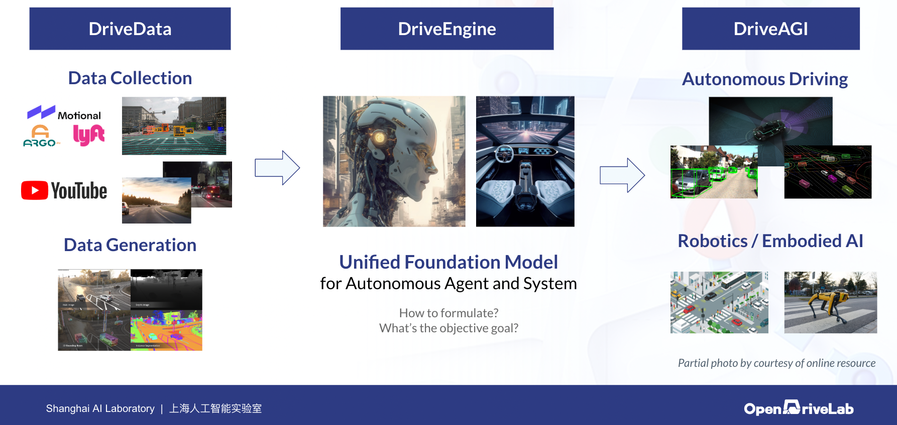

# DriveAGI
This is **"The One"** project that [**`OpenDriveLab`**](https://opendrivelab.com/) is committed to contribute to the community, providing some thought and general picture of how to embrace `foundation models` into autonomous driving.

## At A Glance

Here are some key components to construct a large foundation model curated for an autonomous system.

---
Below we would like to share the latest update from our team on the **`DriveData`** side. We will release the detail of the **`DriveEngine`** and the **`DriveAGI`** in the future.

## DriveLM
Introducing the First benchmark on **Language Prompt for Driving**.

**Quick facts:**
- Task: given the language prompts as input, predict the trajectory in the scene
- Origin dataset: `nuScenes`
- Estimated date of release: `Mid August, 2023`
- Repo: https://github.com/OpenDriveLab/DriveLM (TBA)

## OpenScene
The Largest up-to-date **3D Occupancy Forecasting** dataset for visual pre-training.

**Quick facts:**
- Task: given the large amount of data, predict the 3D occupancy in the environment. 
- Origin dataset: `nuPlan`
- Estimated date of release: `Early August, 2023`
- Repo: https://github.com/OpenDriveLab/OpenScene
- Related work: [OccNet](https://github.com/OpenDriveLab/OccNet), [3D Occupancy Prediction Challenge 2023](https://opendrivelab.com/AD23Challenge.html#Track3) 

## OpenLane-V2 Update
Flourishing [OpenLane-V2](https://github.com/OpenDriveLab/OpenLane-V2) with **Standard Definition (SD) Map and Scene Elements**.

**Quick facts:**
- Task: given SD-map (also known as ADAS map) and scene elements as input, build the driving scene on the fly _without_ aid of HD-map. 
- Estimated date of release: `Late July, 2023`
- Repo: https://github.com/OpenDriveLab/OpenLane-V2
- Related work: [TopoNet](https://github.com/OpenDriveLab/TopoNet), [Lane Topology Challenge 2023](https://opendrivelab.com/AD23Challenge.html#openlane_topology) 

